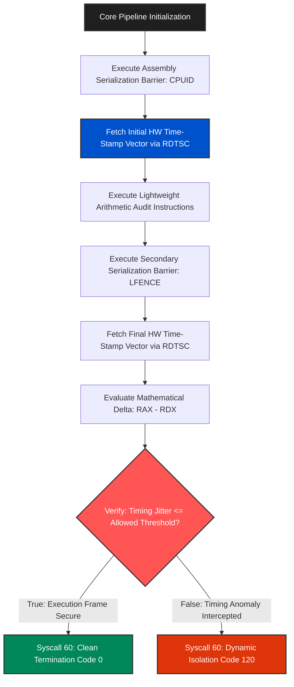

# Boutaba-Kernel-Jitter-Clock-Verifier

## Overview
**Boutaba-Kernel-Jitter-Clock-Verifier** is an ultra-advanced, low-level microarchitectural defense utility engineered in **Pure x86_64 Assembly** for Linux platforms. Operating natively at the boundary of hardware instruction pipelines, this non-malicious module implements an innovative defensive layer focused on detecting structural timing analysis anomalies (Anti-Timing Analysis). 

By extracting direct cycle-level entropy metrics from the internal hardware registers of the CPU, the program audits the execution timeline to ensure that standard code block transitions maintain sub-nanosecond synchronization. If an unauthorized virtual sandbox environment or advanced dynamic instrumentation framework tries to slow down execution to log parameters, the module intercepts the timing delta via assembly branch loops and immediately aborts the process securely to protect intellectual property.

---

## Technical Architecture & Core Execution Flow

The framework executes two consecutive time-stamp capture loops. It computes the delta variation (Jitter) dynamically at a hardware level using register flags to enforce code block execution alignment.


---

## Deployment & Verification

```bash
# Assemble the source layer into formal ELF64 object layout structure
nasm -f elf64 clock_verifier.asm -o clock_verifier.o

# Link the object modules into a standalone static executable architecture
ld clock_verifier.o -o boutaba_clock_verifier

# Clear structural overhead tables to enforce maximum binary obfuscation
strip --strip-all boutaba_clock_verifier
```

---

## Specifications
- **Language:** Pure Assembly (x86_64 ASM 100.0%)
- **Microarchitectural Engineering:** Asynchronous Clock Jitter Delta Verification
- **Target OS Context:** Ring 3 Process Space interacting with Linux Kernel ABI.

---
*Developed and maintained by **Boutaba Motezeballah** — Systems Architect & Reverse Engineer.*
