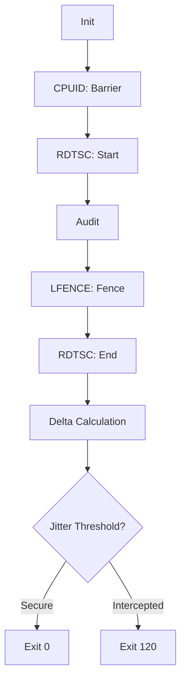

# Technical Blueprint: Boutaba Kernel Jitter Clock Verifier (v3.0)
**Chief Architect:** Motezeballah Boutaba | **Platform:** x86_64 Linux | **Language:** 100% Assembly

##  1. Microarchitectural Core Design Flow
The tool utilizes `CPUID` and `LFENCE` for pipeline serialization to detect timing anomalies, ensuring secure execution frames.



##  2. Deployment
```bash
nasm -f elf64 clock_verifier.asm -o clock_verifier.o
ld clock_verifier.o -o boutaba_clock_verifier
strip --strip-all boutaba_clock_verifier
```
