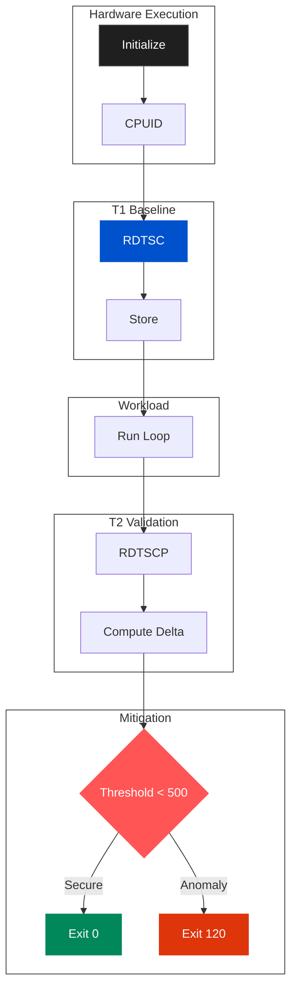

# Technical Blueprint: Boutaba Kernel Jitter Clock Verifier (v3.0)

**Chief Architect:** Motezeballah Boutaba
**Target Architecture:** x86_64 Linux Optimized
**Design Paradigm:** Pure Assembly Runtime Entropy Audit

---

##  1. Microarchitectural Core Design Flow

The framework uses a two-stage time-stamp capture, isolating code between `CPUID` and `RDTSCP` instructions to eliminate speculative execution interference and detect virtualization.



---

##  2. Low-Level Pipeline Specifications

*   **Serialization:** Uses `CPUID` to flush pipeline and establish a clean baseline.
*   **Precision:** Employs `RDTSC` and `RDTSCP` to calculate execution cycles.
*   **Defense:** Enforces a 500-cycle threshold, terminating on unexpected latency.

---

##  3. Compilation & Usage

```bash
nasm -f elf64 clock_verifier.asm -o clock_verifier.o
ld clock_verifier.o -o boutaba_clock_verifier
strip --strip-all boutaba_clock_verifier
```

---

##  4. Metadata
- **Language:** 100% Assembly (x86_64)
- **Target:** Linux Kernel ABI
